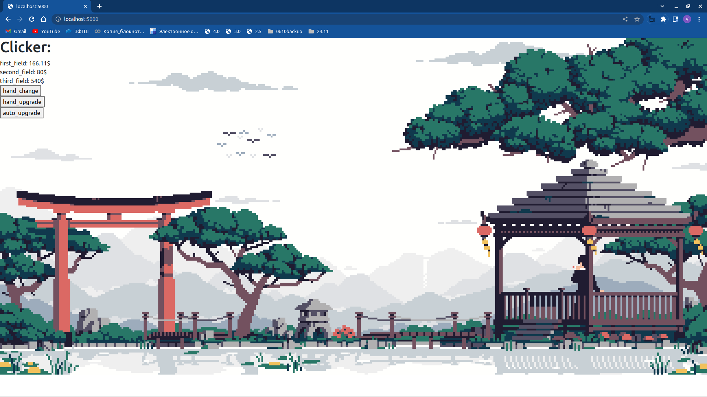

# Python_2nd_project

### Тема прокета - Клавиатурный тренажёр

## Установка и запуск

   ```console
   git clone git@github.com:Vadim14032022/Python_2nd_project.git
   cd Python_2nd_project
   pip install requirements.txt
   chmod +x app.py
   ./app.py
   ```

## Структура проекта

#### app.py - главный исполняемый файл


## Текущая версия


