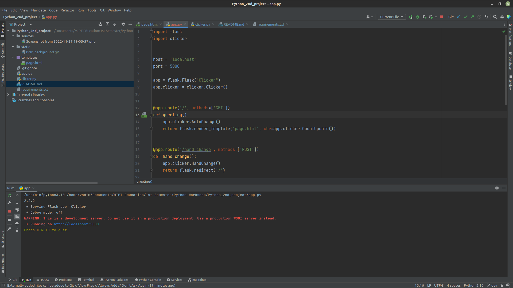
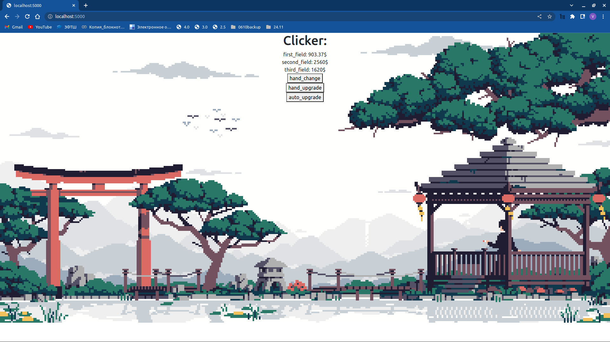

# Python_2nd_project

### Тема прокета - Онлайн кликер

## Установка и запуск

   ```console
   git clone git@github.com:Vadim14032022/Python_2nd_project.git
   cd Python_2nd_project
   pip install requirements.txt
   chmod +x app.py
   ./app.py
   ```
  перейти по ссылке http://localhost:5000



## Структура проекта

#### app.py - главный исполняемый файл
clicker.py - класс кликера 


## Текущая версия
Функционал:
  1) Нажатие на "hand change" увеличивает счет на HandDelta, изначально равный 1
  2) Нажатие на "hand delta" увеличивает HandDelta, списывая из очков стоимость улучшения, если столько имеется, при этом стоимость улучшения увеличивается после каждой покупки
  3) Нажатие на "auto delta" увеличивает AutoDelta, которое начисляется каждую секунду, списывая из очков стоимость улучшения, если столько имеется, при этом стоимость улучшения увеличивается после каждой покупки
  4) Анимированный фон


